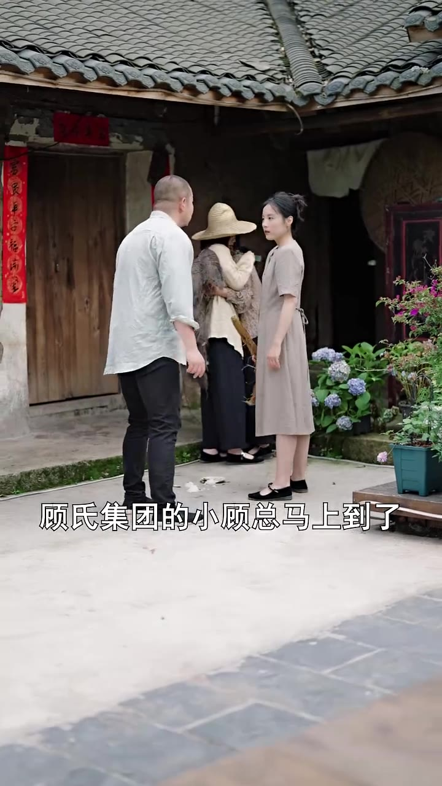

# 第02集 · 第二集

> 时长 79.7s · 镜头切换 47 处 · 台词 4 段

### 场景 1

### 场景 2

> **烧屏字幕**: 区西国饭您 ／ 顾氏集团的小顾总马上到子

`039.9` 是极端小故终马上到了。

`041.9` **「你赶快去做饭啊。」**

`043.9` **「好的。」**

### 场景 3

> **烧屏字幕**: 怎么和记忆中的妈妈有几分像

`066.5` **「这位姑娘,怎么和极端的妈妈有几分像呢?」**

