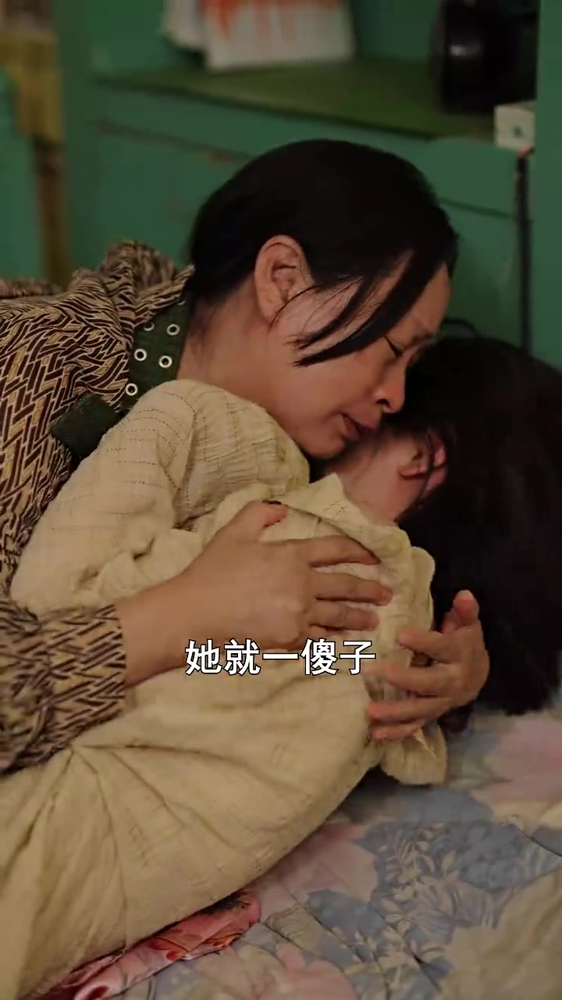
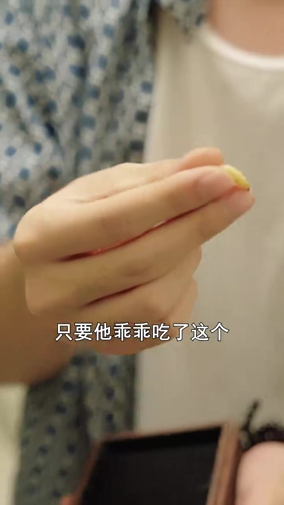
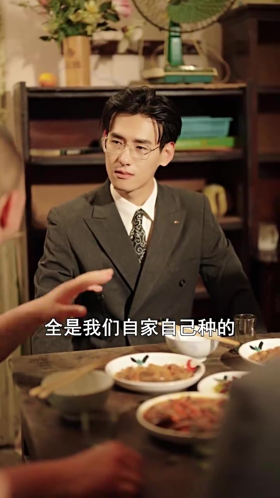
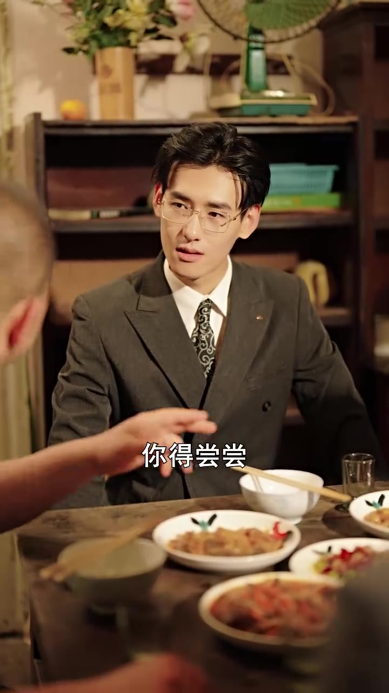
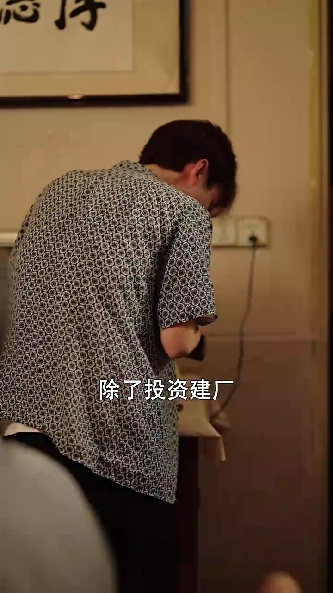
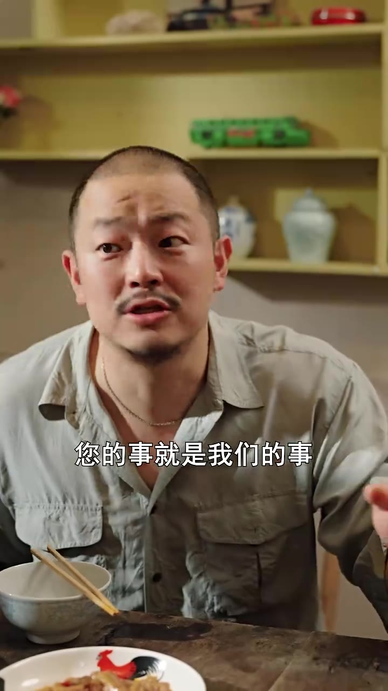
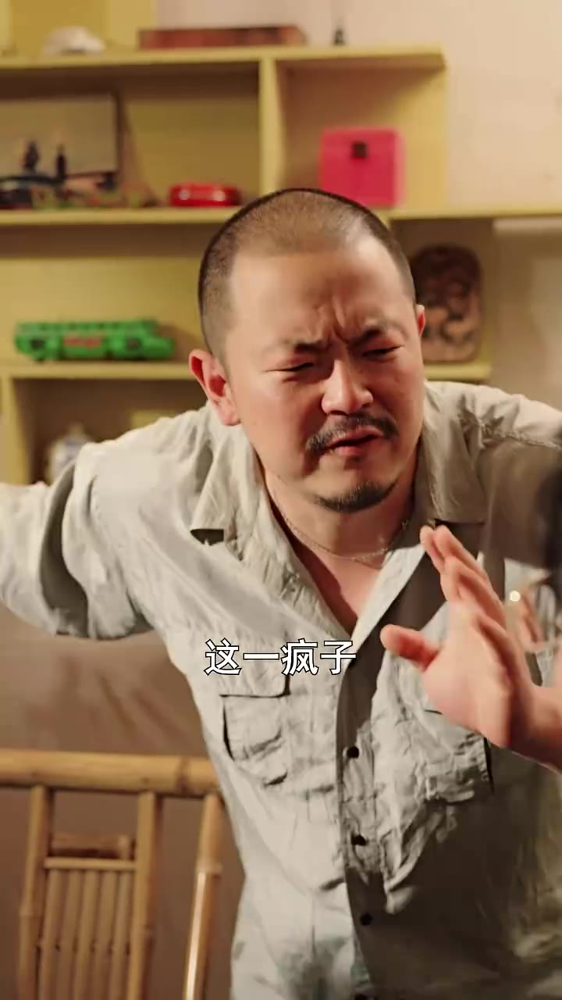

# 第04集 · 第四集

> 时长 119.8s · 镜头切换 64 处 · 台词 28 段

### 场景 1

> **烧屏字幕**: 爸喊你

`005.7` **「你啥事啊?」**

### 场景 2

> **烧屏字幕**: 她就一傻子

`012.4` **「有事直接说他就,就于啥事了?」**

`014.4` **「就是故事其他小顾总,」**

`016.4` 会让你准备一些下午的食材。

### 场景 3

> **烧屏字幕**: 只要他乖乖吃了这个

`026.5` **「只要他乖乖吃了这个,」**

`028.5` 我让他吐多少,，他就得了。

### 场景 4

> **烧屏字幕**: 丽啊

`032.5` **「小李,」**

`034.5` 刚刚的事,别跟他说了。

### 场景 5

> **烧屏字幕**: 哈哈哈

`040.5` 他们这些材料,

### 场景 6

> **烧屏字幕**: 全是我们自家自己种的

`050.1` **「全是五次纯天然,」**

### 场景 7

> **烧屏字幕**: 你得尝尝

`054.1` **「冒伤啊这个。」**

### 场景 8

> **烧屏字幕**: 河行 ／ 除了投资建厂

`065.6` 这次下乡,除了投资检查,，我还有一件事情,，我找我幼年走势的妹妹,，她后围一样,，苏古边有一个名貌伴的爱情，她果然是出货哥哥。

### 场景 9

> **烧屏字幕**: 您的事就是我们的事

`090.5` **「行,小顾总,您的事,」**

`092.5` **「就是我们的事,」**

`094.5` 我们一定全力去办。

`096.5` **「来,我们干一杯。」**

### 场景 10

> **烧屏字幕**: 对不起对不起

`100.5` 小顾总,对不起对不起对不起。

`102.5` **「没事没事没事,」**

`104.5` **「你的小姐人,」**

`106.5` **「怎么来,别打人啊。」**

### 场景 11

> **烧屏字幕**: 这一疯子

`111.7` 不,对不起,这也疯子,

`113.7` **「这,」**

