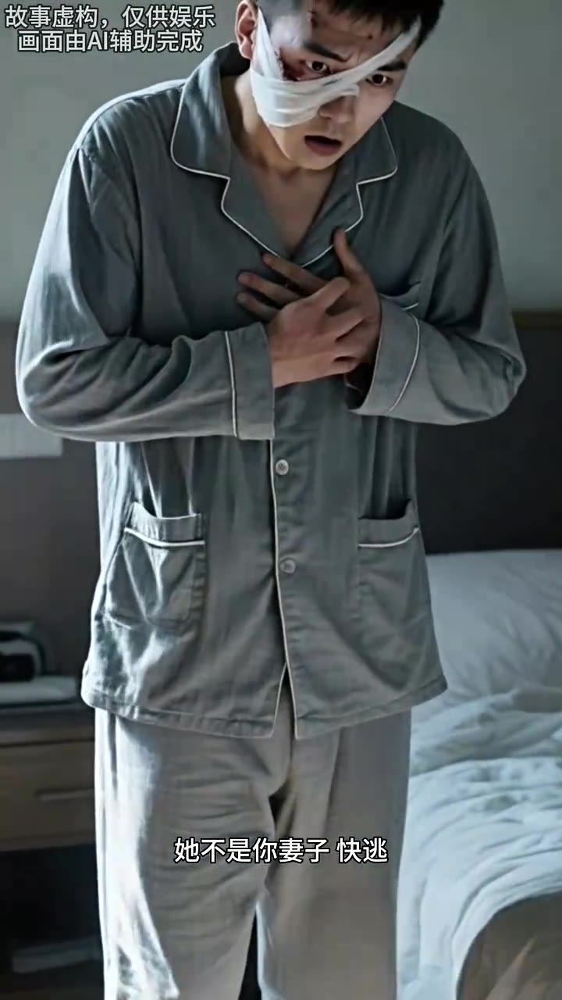
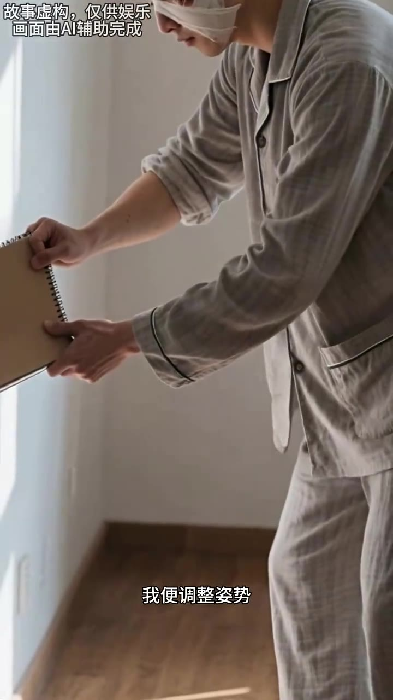
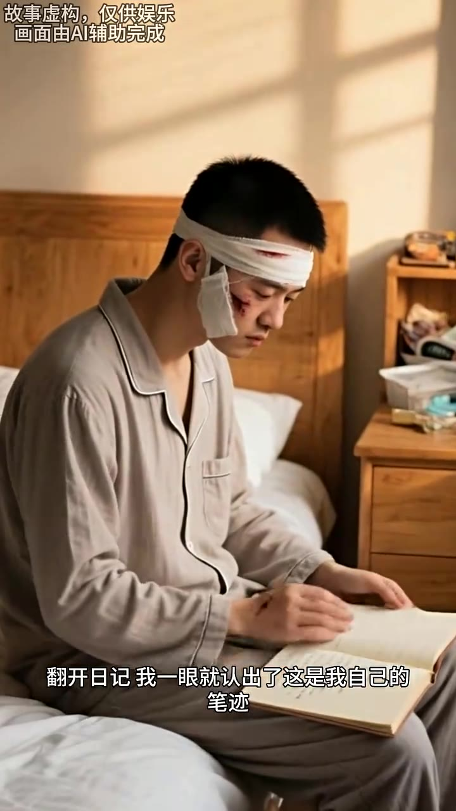
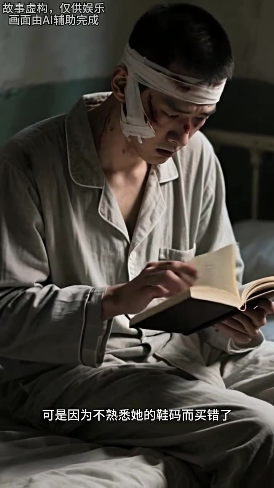
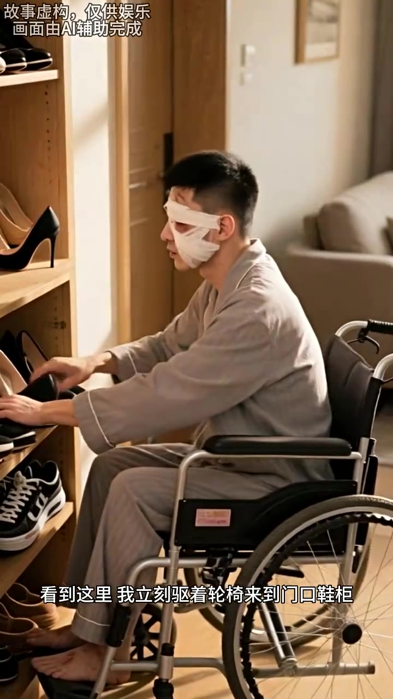

# 《她不是你的妻子》剧本（增强版：含画面+烧屏字幕）

# 第01集 · 第一集

> 时长 77.8s · 镜头切换 13 处 · 台词 21 段

### 场景 1

> **烧屏字幕**: 故事虚构，仅供娱乐 ／ 画面由A辅助完成 ／ 车祸失忆后

`000.0` 车祸失以后,美丽的妻子一切不力不弃地照顾我，奇怪,我日记里写着,妻子鼻子左边有颗痴,，可她脸上干干净净,正当我们以后不解释，地板下传了一个女人的声音。

### 场景 2

> **烧屏字幕**: 故事虚构，仅供娱乐 ／ 画面由A辅助完成 ／ 她不是你妻子快逃

`015.0` 她不是你妻子,快逃。

### 场景 3

> **烧屏字幕**: 故事虚构，仅供娱乐 ／ 画面由A辅助完成 ／ 这到底怎么回事

`016.8` **「这到底怎么回事?」**

`018.6` 不久之前,我遭遇了一种严重的车祸，一生就活了我,但头部的重刹让我变成了植物人，一生建议妻子带我回家慢慢休养,，以为植物人的病情很难说,有可能几天就醒了,

### 场景 4

> **烧屏字幕**: 故事虚构，仅供娱乐 ／ 画面由A辅助完成 ／ 又或者几十年都不会醒

`035.6` 又或者几十年都不会醒，妻子便带我回家,日夜不休地照顾我，直到三十天前,我奇迹般地从植物人状态中醒了过来，车祸的后遇这样有很多大脑的损伤,

### 场景 5

> **烧屏字幕**: 故事虚构，仅供娱乐 ／ 画面由A辅助完成 ／ 让我失去了车祸前的所有记忆

`049.6` 让我失去了车祸前的所有记忆，腿部的重创让我下肢变得没有直觉，脸部遭遇在车祸中遭到冲击与摩擦,，变得面目全非,至今仍需要每天换药来进行缓慢恢复。

### 场景 6

> **烧屏字幕**: 故事虚构，仅供娱乐 ／ 画面曲A辅助光成 ／ 可妻子没有嫌弃我

`063.6` 可妻子没有嫌弃我,她不愿其凡地照顾我,，告诉我发生的一切,帮我在记忆一片空白时稳住了心神,

### 场景 7

> **烧屏字幕**: 故事虚构，仅供娱乐 ／ 画面由A辅助完成 ／ 一步步展开新生活

`072.6` **「一步步展开新生活。」**

---

# 第02集 · 第二集

> 时长 75.1s · 镜头切换 11 处 · 台词 16 段

### 场景 1

> **烧屏字幕**: 故事虚构，仅供娱乐 ／ 画面由Al辅助完成 ／ 每夫早晨她都要拆开

`000.0` 每天早晨,他都要拆开我头上一圈圈,沾着血迹和碎肉的纱布,在我不满可不伤口的脸上上有,再用纱布缠起来，这过程对我来说, 痛折心非,其子常常心疼不已。

### 场景 2

> **烧屏字幕**: 故事虚构，仅供娱乐 ／ 画面苗A辅助完成 ／ 接下来她会抱着我下床

`015.2` 接下来,他会下床,将我放在轮椅上,推我到客厅吃早饭，然后他帮我穿好外套,吹着我下楼到小区里散心，做完这一切,他才把我推回家,开始收拾东西,准备出门上班。

### 场景 3

> **烧屏字幕**: 故事虚构，仅供娱乐 ／ 画面曲A辅助完成 ／ 我真的非常感谢她

`033.3` 我真的非常感谢他，我要去上班了,饭已经给你做好了,你中午热着吃就行，妻子的声音从门口传了，我双手转动轮椅,来到客厅向他挥手道别。

### 场景 4

> **烧屏字幕**: 故事虚构，仅供娱乐 ／ 日送妻子离去后我来到卧室

`046.4` **「路上小心。」**

### 场景 5

> **烧屏字幕**: 故事虚构，仅供娱乐 ／ 日送妻子离去后我来到卧室

`047.8` 目送妻子离去后,我来到卧室,开始挑金田有看的书，这三十天来,我已经大致了解了过去自己的母亲喜好，我素顾是个对书,电影,音乐都有所设类的人。

### 场景 6

> **烧屏字幕**: 故事虚构，仅供娱乐 ／ 音乐磁带电影DVD

`062.2` 家里有大量书籍,音乐磁带,电影, DVD，妻子说这些都是我曾经喜欢的东西,把他们放在我坐着轮椅能拿到的地方，供我白天在家打发时间。

---

# 第03集 · 第三集

> 时长 82.6s · 镜头切换 12 处 · 台词 16 段

### 场景 1

> **烧屏字幕**: 故事虚构，仅供娱乐 ／ 挑来挑去我挑了一本海明威的书

`000.0` 挑来挑去,我挑了一本海敏威的书,当即翻开看了起来，正当我沉溺于书中事件,不知过了多久时,一个声音响了起来，他不是你妻子。

### 场景 2

> **烧屏字幕**: 故事虚构，仅供娱乐 ／ 画面由A辅助完成 ／ 我茫然抬头看向电视

`012.5` 我茫然抬头,太像电视,还以为是DVD播放器也自动开启后,播放了什么定的台词，但没有电视一片漆黑,是幻听，他不是你妻子。

### 场景 3

> **烧屏字幕**: 故事虚构，仅供娱乐 ／ 画面由A辅助完成 ／ 那声音再次响起回荡在我耳边

`025.3` 那声音再次响起,回荡在我耳边,仿佛什么人在屋子里低声喊了这句话。

### 场景 4

> **烧屏字幕**: 故事虚构，仅供娱乐 ／ 画面苗A辅助完成 ／ 难道进了小偷

`031.7` **「难道进了小头,我声音有些颤抖的问,谁?」**

### 场景 5

> **烧屏字幕**: 故事虚构，仅供娱乐 ／ 画面由A辅助完成 ／ 现在跟你生活的那个女人

`036.3` 现在跟你生活的那个女人不是你的妻子,你要小心,卧室床头跪下,有一本日记，伴随着那声音第三次响起,我终于听出来,声音来源于地板下方,像是个嗓子沙雅女性在说话。

### 场景 6

> **烧屏字幕**: 故事虚构，仅供娱乐 ／ 画面由Al辅助完成 ／ 我住在2楼地板下面自然就是1楼的住

`051.5` 我住在二楼,地板下面自然就是一楼的住户。

### 场景 7

> **烧屏字幕**: 故事虚构，仅供娱乐 ／ 画面由A辅助完成 ／ 我朝着地板开口问道 是楼下邻居吗

`055.6` **「吃一味一下,我朝着地板开口温闹,是楼下邻居吗?」**

### 场景 8

> **烧屏字幕**: 故事虚构，仅供娱乐 ／ 之后无论我问什么楼下都不再有任何回

`060.3` 没有回答,之后无论我问什么,楼下都不再有任何回应，我赶到一桶污水,不过随着而来的,还有一种奇特的愉悦感。

### 场景 9

> **烧屏字幕**: 故事虚构，仅供娱乐 ／ 画面由A辅助完成 ／ 我除了跟妻子说过话

`071.0` 这三十天来,我除了跟妻子说过话,没有跟其他任何人交流过，楼下邻居的声音,是我有记忆以来基础的第二个人。

---

# 第04集 · 第四集

> 时长 81.5s · 镜头切换 11 处 · 台词 39 段

### 场景 1

> **烧屏字幕**: 故事虚构，仅供娱乐 ／ 反正闲来无事不如照她说的找找那本 ／ 日记

`000.0` 反正闲来无事不如照他说的找找那本日记，抱着这种无聊有后期的想法，我来到床边的床头柜，我家的床头柜底部是被四个柜脚撑起来的，离地板有一段不小的缝隙

### 场景 2

> **烧屏字幕**: 故事虚构，仅供娱乐 ／ 画面由A辅助完成 ／ 我奋力把手伸进缝隙处摸了半天

`016.7` 我分离把手伸进缝隙处磨了半天

### 场景 3

> **烧屏字幕**: 故事虚构，仅供娱乐 ／ 画面由A辅助完成 ／ 正当我自嘲上了当

`020.1` **「什么都没有」**

`021.5` **「正当我自嘲上了当」**

`023.3` **「准备把手抽回来的时候」**

`025.5` 我的手背碰到了一个烧硬的缝隙

`028.0` **「似乎仅贴在床头柜底部」**

### 场景 4

> **烧屏字幕**: 故事虚构，仅供娱乐 ／ 画面由Al辅助完成 ／ 我反过手摸了摸那东西确实像是个本

`030.0` **「还真有」**

`031.3` 我反过手磨了磨那东西

`034.4` **「确实像是个板子」**

### 场景 5

> **烧屏字幕**: 故事虚构，仅供娱乐 ／ 画面曲A辅助完成 ／ 我便调整姿势

`035.9` 我便调整姿势

`037.7` **「抓住了本子的边缘」**

`039.6` **「用力一扯」**

`041.0` **「把那东西扯了出来」**

### 场景 6

> **烧屏字幕**: 故事虚构，仅供娱乐 ／ 画面由A辅助完成 ／ 拿起来一看果真如楼下邻居所说

`042.6` **「拿起来一看」**

`044.0` **「果真如楼下邻居所说」**

`046.2` 是一本封面破破啦啦的日记，备用胶带贴在了床头柜底部

### 场景 7

> **烧屏字幕**: 故事虚构，仅供娱乐 ／ 翻开日记我一眼就认出了这是我自己的 ／ 笔迹

`051.3` **「翻开日记」**

`052.7` 我研究认出了

`053.8` **「这是我自己的笔记」**

`055.5` 跟我这30天来写的字一模一样，难道是诗意前的自己写的

### 场景 8

> **烧屏字幕**: 故事虚构，仅供娱乐 ／ 画面由Al辅助完成 ／ 这么想着我兴致勃勃地读了起来

`060.3` **「这么想着」**

`061.6` 我性质薄薄的读了起来

### 场景 9

> **烧屏字幕**: 故事虚构，仅供娱乐 ／ 画面苗减辅助完成 ／ 虽然妻子也会告诉我一些失忆前的事情

`063.4` **「虽然妻子也会告诉我」**

`065.1` **「一些诗意前的事情」**

`066.9` **「但看自己的日记」**

`068.0` **「毕竟'll更加具体现」**

`069.8` 也能了解自己是个什么样的人

### 场景 10

> **烧屏字幕**: 故事虚构，仅供娱乐 ／ 但读着读着我逐渐发现了不对劲的地方

`071.8` **「但读了读着」**

`073.1` 我逐渐发现了

`074.3` **「不对劲的地方」**

`075.9` **「明明是凉爽的秋季」**

`077.8` 我的额头却开始冒汗

---

# 第05集 · 第五集

> 时长 78.9s · 镜头切换 7 处 · 台词 7 段

### 场景 1

> **烧屏字幕**: 故事虚构，仅供娱乐 ／ 第一个不对劲的地方是痣

`000.0` 第一个不对劲的地方,是指,一篇日记里提到了这么一件事,有一天妻子想要点掉鼻子走错的一颗指,我却觉得没必要纯属乱花闲,我们稍微争执了一下,妻子便妥协了。

### 场景 2

> **烧屏字幕**: 故事虚构，仅供娱乐 ／ 画面由A辅助芫成 ／ 看完这篇日记

`016.0` 看完这篇日记,我第一时间并未察觉到问题所在,只是心里感觉有些意义。过了好一会儿,我才突然意识到,在过去三十天的相处中,妻子的脸上干干净净。

### 场景 3

> **烧屏字幕**: 故事虚构，仅供娱乐 ／ 画面由A辅助完成 ／ 别说痣了连痘痘都看不见

`029.8` 别说志了,连豆豆都看不见。之所以记得这么清楚,是因为我曾看着她漂亮的脸,赶到晚夕。晚夕她还这么年轻漂亮,就要为我这么个参计丈夫操劳。

### 场景 4

> **烧屏字幕**: 故事虚构，仅供娱乐 ／ 画面由A辅助完成 ／ 某种恐惧开始在心中升起

`041.8` 某种恐惧开始在心中生气。我连忙继续翻下去,又看到一篇日记里提到,我曾在妻子生日的时候,给她买过一双白色高跟鞋做礼物。

### 场景 5

> **烧屏字幕**: 故事虚构，仅供娱乐 ／ 可是因为不熟悉她的鞋码而买错了

`053.8` 可是因为不熟悉她的鞋码而买错了。妻子的脚是三十八码,我买的鞋根本不合脚。

### 场景 6

> **烧屏字幕**: 故事虚构，仅供娱乐 ／ 画面由A辅助芫成 ／ 看到这里我立刻驱着轮椅来到门口鞋柜

`060.8` 看到这里,我立刻趋着轮椅来到门口鞋柜,找出了妻子的一堆高跟鞋和运动鞋,一个都拿起来看。这些鞋无余例外都是三十六码，现在这个妻子的脚码跟以前不一样,小了两个码。

---
