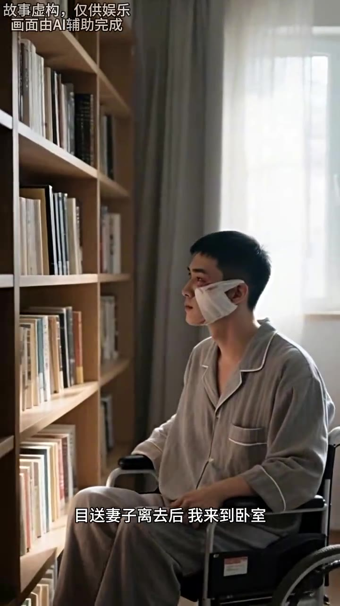
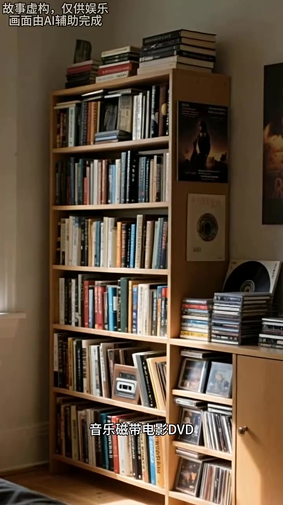

# 第02集 · 第二集

> 时长 75.1s · 镜头切换 11 处 · 台词 16 段

### 场景 1

> **烧屏字幕**: 故事虚构，仅供娱乐 ／ 画面由Al辅助完成 ／ 每夫早晨她都要拆开

`000.0` 每天早晨,他都要拆开我头上一圈圈,沾着血迹和碎肉的纱布,在我不满可不伤口的脸上上有,再用纱布缠起来，这过程对我来说, 痛折心非,其子常常心疼不已。

### 场景 2

> **烧屏字幕**: 故事虚构，仅供娱乐 ／ 画面苗A辅助完成 ／ 接下来她会抱着我下床

`015.2` 接下来,他会下床,将我放在轮椅上,推我到客厅吃早饭，然后他帮我穿好外套,吹着我下楼到小区里散心，做完这一切,他才把我推回家,开始收拾东西,准备出门上班。

### 场景 3

> **烧屏字幕**: 故事虚构，仅供娱乐 ／ 画面曲A辅助完成 ／ 我真的非常感谢她

`033.3` 我真的非常感谢他，我要去上班了,饭已经给你做好了,你中午热着吃就行，妻子的声音从门口传了，我双手转动轮椅,来到客厅向他挥手道别。

### 场景 4

> **烧屏字幕**: 故事虚构，仅供娱乐 ／ 日送妻子离去后我来到卧室

`046.4` **「路上小心。」**

### 场景 5

> **烧屏字幕**: 故事虚构，仅供娱乐 ／ 日送妻子离去后我来到卧室

`047.8` 目送妻子离去后,我来到卧室,开始挑金田有看的书，这三十天来,我已经大致了解了过去自己的母亲喜好，我素顾是个对书,电影,音乐都有所设类的人。

### 场景 6

> **烧屏字幕**: 故事虚构，仅供娱乐 ／ 音乐磁带电影DVD

`062.2` 家里有大量书籍,音乐磁带,电影, DVD，妻子说这些都是我曾经喜欢的东西,把他们放在我坐着轮椅能拿到的地方，供我白天在家打发时间。

