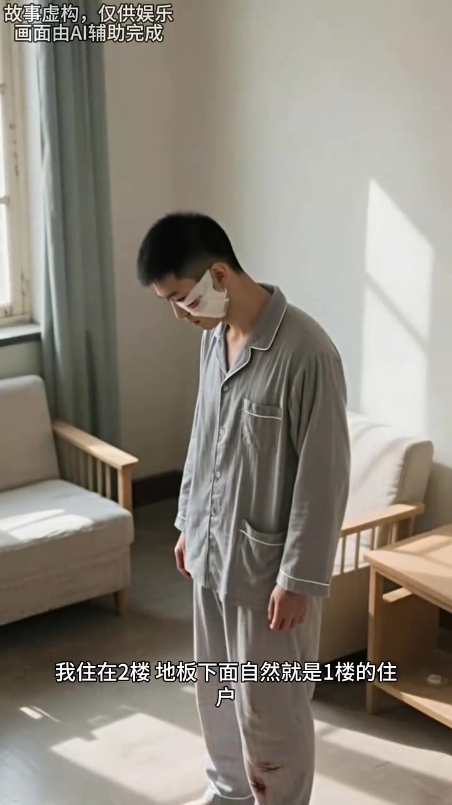
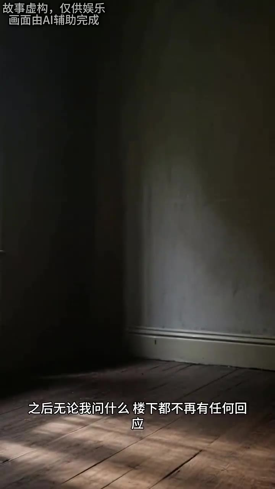

# 第03集 · 第三集

> 时长 82.6s · 镜头切换 12 处 · 台词 16 段

### 场景 1

> **烧屏字幕**: 故事虚构，仅供娱乐 ／ 挑来挑去我挑了一本海明威的书

`000.0` 挑来挑去,我挑了一本海敏威的书,当即翻开看了起来，正当我沉溺于书中事件,不知过了多久时,一个声音响了起来，他不是你妻子。

### 场景 2

> **烧屏字幕**: 故事虚构，仅供娱乐 ／ 画面由A辅助完成 ／ 我茫然抬头看向电视

`012.5` 我茫然抬头,太像电视,还以为是DVD播放器也自动开启后,播放了什么定的台词，但没有电视一片漆黑,是幻听，他不是你妻子。

### 场景 3

> **烧屏字幕**: 故事虚构，仅供娱乐 ／ 画面由A辅助完成 ／ 那声音再次响起回荡在我耳边

`025.3` 那声音再次响起,回荡在我耳边,仿佛什么人在屋子里低声喊了这句话。

### 场景 4

> **烧屏字幕**: 故事虚构，仅供娱乐 ／ 画面苗A辅助完成 ／ 难道进了小偷

`031.7` **「难道进了小头,我声音有些颤抖的问,谁?」**

### 场景 5

> **烧屏字幕**: 故事虚构，仅供娱乐 ／ 画面由A辅助完成 ／ 现在跟你生活的那个女人

`036.3` 现在跟你生活的那个女人不是你的妻子,你要小心,卧室床头跪下,有一本日记，伴随着那声音第三次响起,我终于听出来,声音来源于地板下方,像是个嗓子沙雅女性在说话。

### 场景 6

> **烧屏字幕**: 故事虚构，仅供娱乐 ／ 画面由Al辅助完成 ／ 我住在2楼地板下面自然就是1楼的住

`051.5` 我住在二楼,地板下面自然就是一楼的住户。

### 场景 7

> **烧屏字幕**: 故事虚构，仅供娱乐 ／ 画面由A辅助完成 ／ 我朝着地板开口问道 是楼下邻居吗

`055.6` **「吃一味一下,我朝着地板开口温闹,是楼下邻居吗?」**

### 场景 8

> **烧屏字幕**: 故事虚构，仅供娱乐 ／ 之后无论我问什么楼下都不再有任何回

`060.3` 没有回答,之后无论我问什么,楼下都不再有任何回应，我赶到一桶污水,不过随着而来的,还有一种奇特的愉悦感。

### 场景 9

> **烧屏字幕**: 故事虚构，仅供娱乐 ／ 画面由A辅助完成 ／ 我除了跟妻子说过话

`071.0` 这三十天来,我除了跟妻子说过话,没有跟其他任何人交流过，楼下邻居的声音,是我有记忆以来基础的第二个人。

