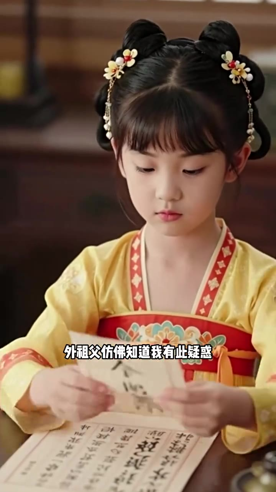
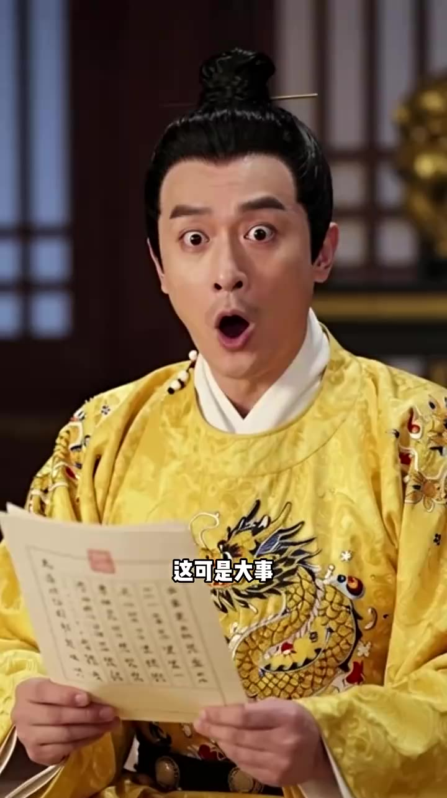
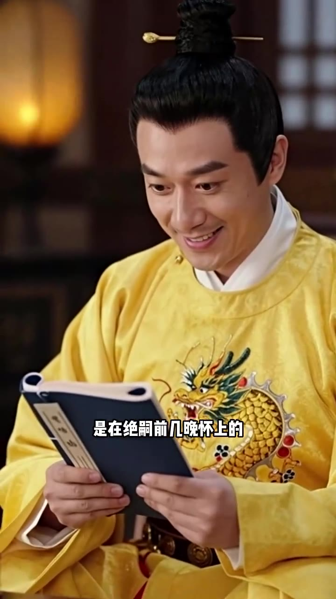
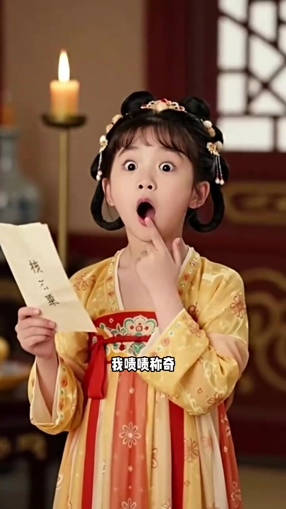

# 第02集 · 第二集

> 时长 61.7s · 镜头切换 18 处 · 台词 6 段

### 场景 1

> **烧屏字幕**: 外租父仿佛知道我有此疑惑

`000.0` **「外祖父仿佛知道我有此疑惑,下一夜便详细记载了苏尚书的详细生品,连几岁有的通房,在外去过几次青楼都详细了一清二楚,并没有私生女。这就奇怪了,不是皇后本人,也不是姐妹假扮的。难道是父皇专程找人替代的?可说不通了,我继续看信,后一夜是皇后回宫全过程。」**

### 场景 2

> **烧屏字幕**: 好力

`018.0` 昨日傍晚,皇后忽然不见了,所有人都急疯了,匆匆寻找,却发现皇后晕倒在后院,他们赶紧找来大夫给皇后医治。

### 场景 3

> **烧屏字幕**: 这可是大事

`025.0` 这一把卖,居然有了。这可是大事,毕竟父皇爵士了。父皇也纠结了一夜,又是算日子,又是查金是房的诚信部,甚至还用天方跌了皇后的血,忙活了整整一夜,最后终于确认这就是他的孩子。

### 场景 4

> **烧屏字幕**: 是在绝嗣前几晚怀上的

`037.0` 是在爵士前几晚还上的,这下子,父皇可高兴坏了,这部立马官赴原位,还隆重准备一仗。

### 场景 5

> **烧屏字幕**: 我喷啧称奇

`043.0` **「看到这,我泽泽称奇,因为昨晚他晕倒了一会儿,我正在给皇后挖坑那,这又来一个皇后,究竟是谁啊?」**

### 场景 6

> **烧屏字幕**: 鼻会赶时简

`049.0` **「真会赶时间,会不会,真是父皇找到了喜爱的女子借此进宫?,我得试探试探,一日我早早起床,一向爱说懒教的娘亲敬人也起了,我疑惑问证。」**

