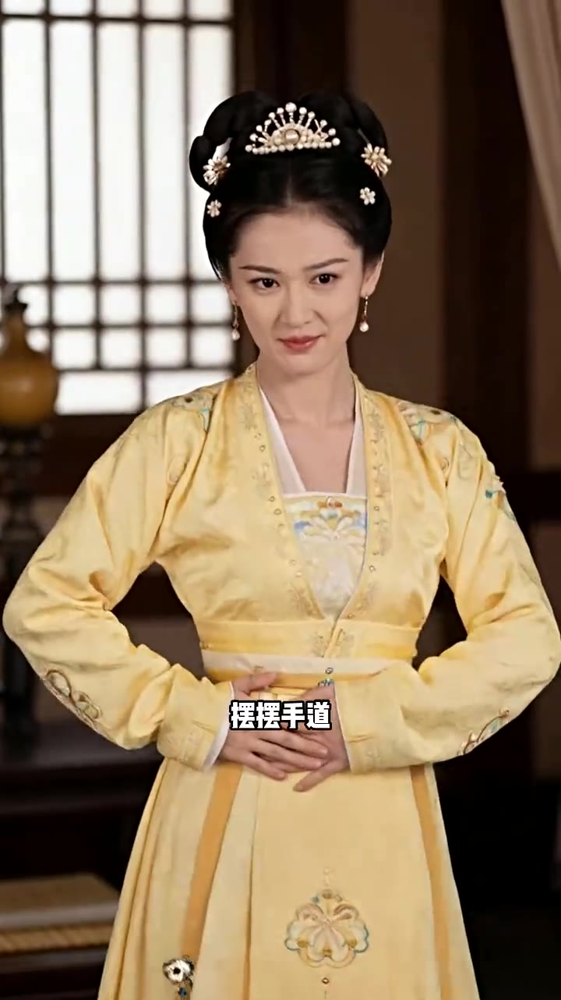
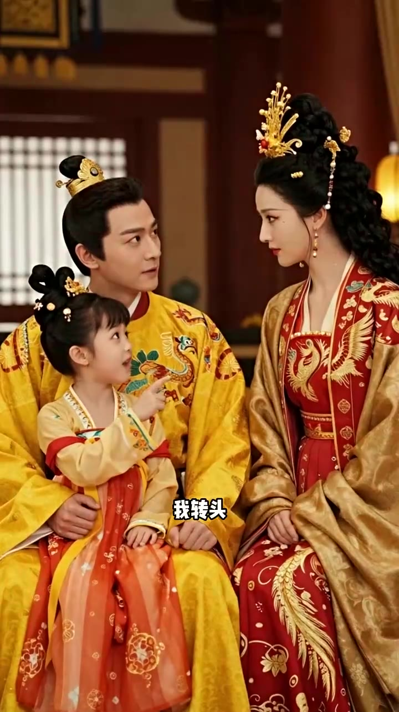
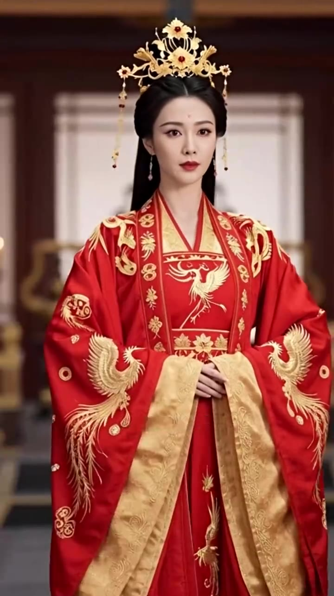
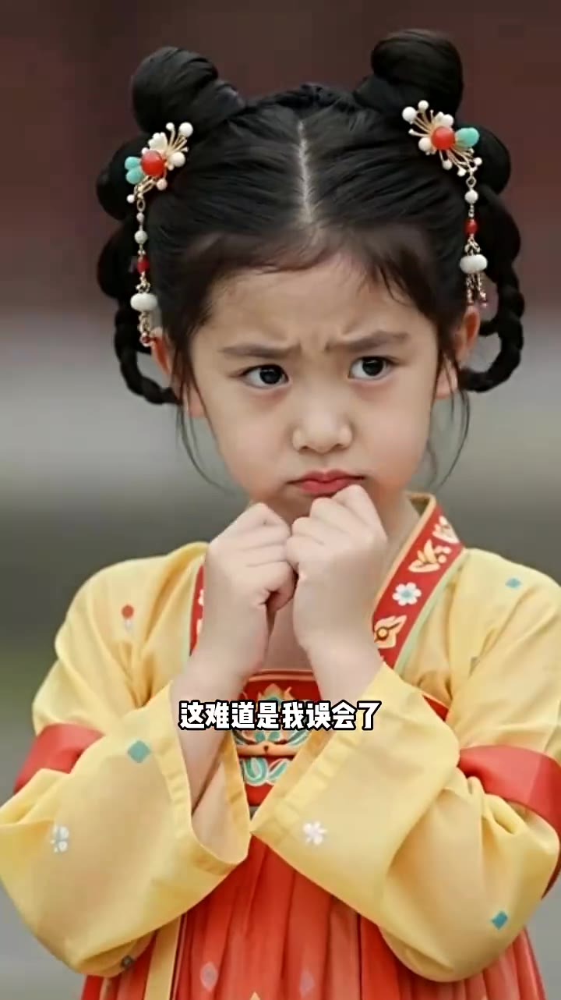
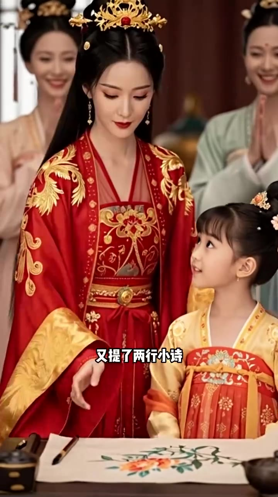
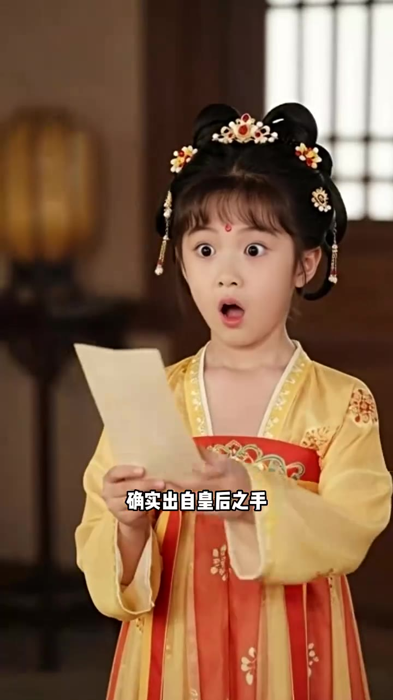

# 第03集 · 第三集

> 时长 64.6s · 镜头切换 16 处 · 台词 22 段

### 场景 1

> **烧屏字幕**: 摆摆手道

`000.0` 我娘眼眸闪了闪,把她守到。

`002.0` **「昨晚梦魇啊,腰疼。」**

`004.0` 睡不着,起床活动活动筋骨，我点头,没多想去了皇后请公，父皇也在,我爬到她腿上，父皇,母后生下小弟弟后妈，怎么会不喜欢你,你可是朕第一个孩子。

### 场景 2

> **烧屏字幕**: 我转头

`017.5` 父皇笑咪咪,我转头,给父皇和皇后挖坑。

`020.5` **「那趁着铺子时后,母后能给我和父皇画一幅画吗?」**

### 场景 3

> **烧屏字幕**: 幼海阳峰司 ／ 意烧典

`025.9` 皇后是苏上书唯一的女儿,自然用心培养，皇后的丹青可是独季,震惊全京城，其他人没有个十几年的模仿功力是模仿不出来的，父皇闻言,愣愣愣,却没有紧张,只是看向皇后。

### 场景 4

> **烧屏字幕**: 染W ／ 这难道是我误会了

`036.9` **「皇后可愿意?」**

`037.9` 这难道是我误会了,不是父皇故意找来的，我又看向皇后,皇后只是撇了我一眼,淡淡微笑开口，既然公主喜欢,臣妾就献丑了，说完,当真一人研磨,画做起来。

### 场景 5

> **烧屏字幕**: 又提了两行小诗

`049.9` 画完,她点了点头,又提了两行小诗,我很满意，这下子画技笔迹都有了,我就不信找不到破绽，只是外祖父和一众大儒研究了一整夜,反复对比后只给我一个结问。

### 场景 6

> **烧屏字幕**: 确实出自皇后之手

`059.9` 这次画,确实出自皇后之手,和之前皇后的话合字,出自同一人。

