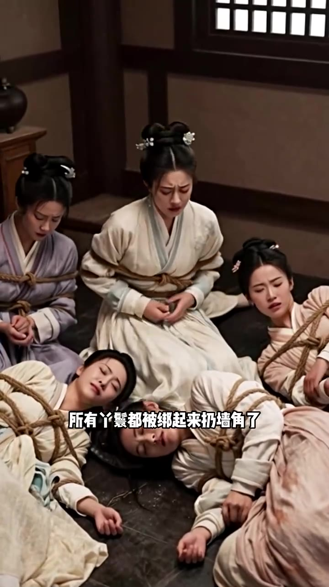

# 第04集 · 第四集

> 时长 58.3s · 镜头切换 14 处 · 台词 22 段

### 场景 1

> **烧屏字幕**: 这是何方种圣

`000.0` 我惊了 这是何方神圣 连皇后的笔墨单轻都会，正在这时 一直飞舰显显插过我脸夹定在桌子上，我拆开信件 看到皇后明惶惶的挑戏

### 场景 2

> **烧屏字幕**: 戌时三刻

`009.2` 缠冰思落雪峰 虚实三克 防我命难 我侧一下站起来，头皮炸了 这女人到底是谁，竟然还知道我何时何地杀了皇后，我夺不思存 到了这个地步 大概率只有两种可能

### 场景 3

> **烧屏字幕**: 皇后换亮子了

`020.4` 要么 皇后换壳子了 但是短时间哪来的那么好的壳子，要么 她是我同事进来的 点了皇后的技能，很多真是同事 我必须得知道她的任务内容，好保证我和我娘安全完成任务离开

### 场景 4

> **烧屏字幕**: 我带着重重心事团囵睡着

`031.9` 我带着重重心事 胡伦睡着，一日一早 我还没起 奶嬷嬷忽然惊慌失措跑进来，说我娘不知从哪弄到了藏红花 一早趁着众人没注意，竟然溜去了卫扬宫 偷偷下在皇后的饮食里

### 场景 5

> **烧屏字幕**: 皇后正捂着肚子哀嚎呢

`043.0` 现在 这肚子肚子哀嚎呢，我敏纯 喘喘衣裳来不及多说 匆匆赶去卫扬宫，刚踏进宫门 就听到里面到处都是挣扎的声音，还有横七竖八 晕倒在地上

### 场景 6

> **烧屏字幕**: 所有丫鬟都被绑起来扔墙角了

`053.3` 所有丫鬟都被绑起来扔墙脚了，我拿孔屋有力的贵妃娘竟然用武力镇压了卫�，我拿孔屋有力的贵妃娘竟然用武力镇压了卫扬宫

