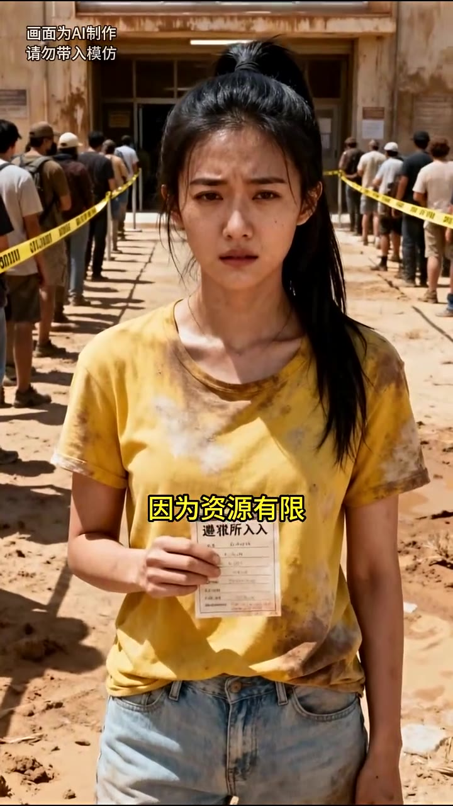
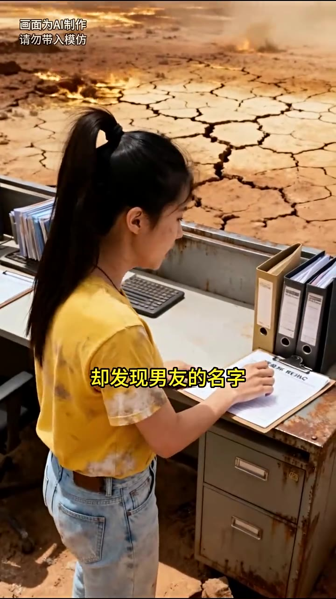
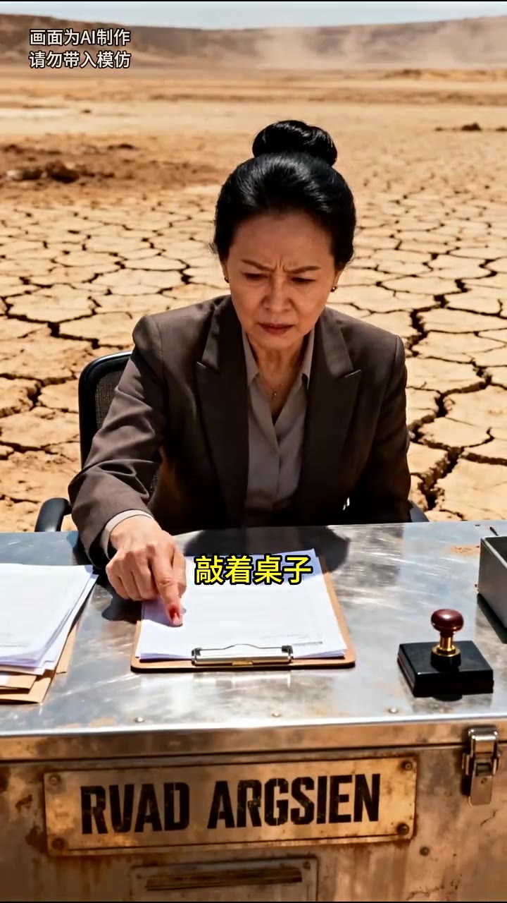
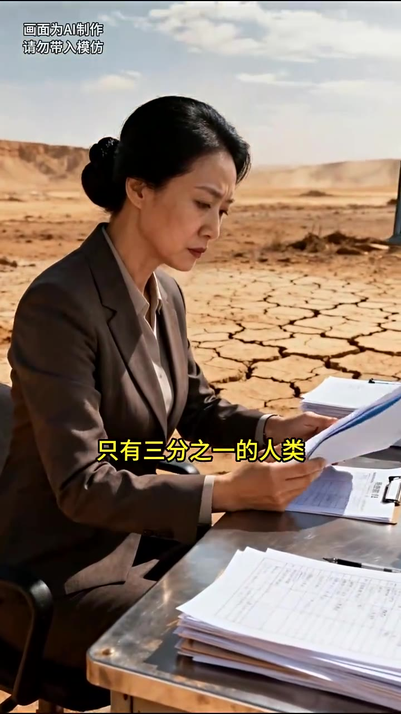
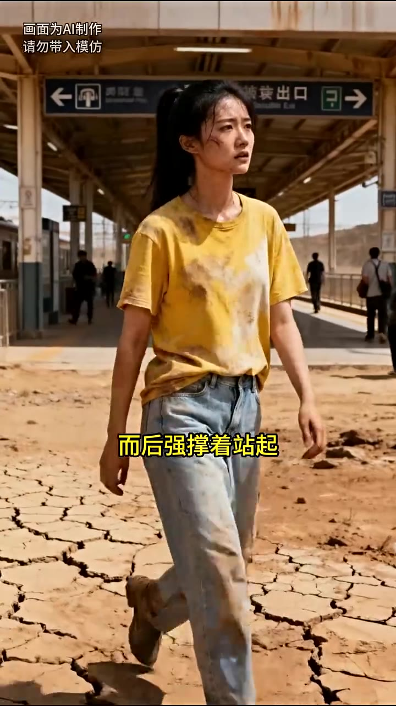

# 第01集 · 第一集

> 时长 68.3s · 镜头切换 18 处 · 台词 19 段

### 场景 1

> **烧屏字幕**: 因为资源有限 ／ 遵雅所入入

`000.0` 极热末世来临 因为资源有限 人类只能抽签进入避难所 男友没抽到，眼眶寒泪的盯着我手中的活命签 我早就换了决证 准备将这活命的机会让给他

### 场景 2

> **烧屏字幕**: 却发现男友的名字

`009.2` 可是走到登记处 却发现男友的名字 赫然躺在登记表的最顶端，注意到我不可知信的眼神 工作人员随口道，哦 齐洛白啊 不用看了 裁罚子弟呢

### 场景 3

> **烧屏字幕**: 都是他家出资建的

`019.0` 整个避难所都是他家出自贱的 哪需要抽签啊 心脏猛的一致 我激进握不住笔，可明明末日来临前 他受了我整整两年的自主

### 场景 4

> **烧屏字幕**: 敲着桌子

`026.8` 工作人员有些不耐烦地敲着桌子 责 姑娘 还捐不捐名额了，我忙擦进眼泪 快速在登记表上写下自己的名字，不捐了 我自己进去 工作人员笼个笼表格

### 场景 5

> **烧屏字幕**: 只有三分之一的人类

`036.8` 也是 只有三分之一的人类能进入避难所 这活命机会还是留给自己好啊，三天后记得去1号站台 前往避难所的车会在那等着

### 场景 6

> **烧屏字幕**: 装出口 ／ 而后强撑着站起

`044.6` 我点头到 谢 然后强撑着站起 脚步发虚的往外走去，齐洛白仍站在门口 见到我铺了个满怀，阿宁 你对我太好了 竟然真的将活命的机会让给我

### 场景 7

> **烧屏字幕**: 该怎么感谢你了

`053.8` 我 我都不知道该怎么感谢你了 我没有回抱住他，反是轻轻推开 齐洛白 你有没有什么想对我说的，他眨着眼睛 脸出一个笑 说什么 说我们家阿宁有动的善良可爱吗

### 场景 8

> **烧屏字幕**: 心底酸楚一片

`063.8` 我看着他 心底酸楚一片 他的笑容之下 究竟藏了多少谎言

