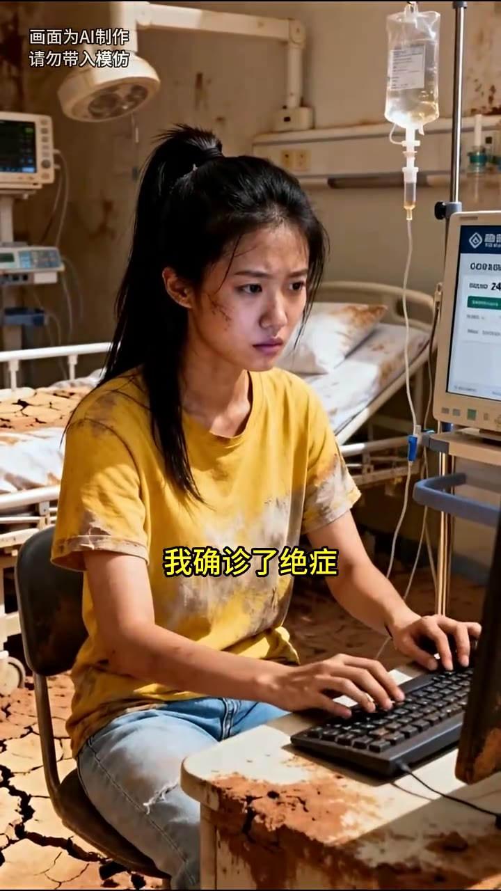

# 第02集 · 第二集

> 时长 75.2s · 镜头切换 19 处 · 台词 20 段

### 场景 1

> **烧屏字幕**: 也要个明白

`000.0` 总归没多少天可活,死也死,要个明白，于是我勉强挤出一抹效,没什么,走吧,回家,他却避开我的手，对我换了换手机,阿宁,我再去打一天工,好给你多留点物资。

### 场景 2

> **烧屏字幕**: 画面为I制作 ／ 近乎无力的垂下手

`011.2` 我望着他的背影,近乎无力地锤下手，两年前,我是在咖啡店打工时遇见的齐洛白,他与我交心攀谈。

### 场景 3

> **烧屏字幕**: 一个人来到海城上大学

`017.4` 说家中父兄早世,一个人来到海城上,大学,压力极大,比时年轻气盛,分不清虚伪与否，反倒是正义心爆棚,在自己结局的情况下,还是选择资助他。

### 场景 4

> **烧屏字幕**: Be如24 ／ 我确诊了绝症

`026.5` 哪怕是一年前,我确诊了绝证,仍是坚持每个月给齐洛白打500块钱，可现在,告诉我一切都是假的,连他不需要的避难所名额,也需要从我这里夺走。

### 场景 5

> **烧屏字幕**: 根据定位来到一个会所前

`035.1` 我抬手抹了把脸,根据定位,来到一个高档会所前，这两年,齐洛白在我面前一直大的方方,甚至还在我的手机上主动安装他的实实定位。

### 场景 6

> **烧屏字幕**: 所以他说他在这里工

`043.2` 所以,他说他在这里打工,我从没怀疑过,我掐了把手心，寻着定位来到一个包箱前,吵两的笑闹声从半开的门缝里溢出来。

### 场景 7

> **烧屏字幕**: 今天怎么喝这么多

`050.6` **「哎,齐哥哥,今天怎么喝这么多?家里那个穷酸货惹你不开心了。」**

### 场景 8

> **烧屏字幕**: 喉头发出低低的笑声

`054.8` 齐洛白点在女孩唇上,喉头发出滴滴的笑声，不是,我只是惊讶,你们是不知道啊,宋宁还真把避难所名额给了我。

### 场景 9

> **烧屏字幕**: 我都快不好意思了

`062.0` 泽泽,我都快不好意思了。女孩的声音有些吃胃,要我说,齐哥哥可快甩了他吧，一场真心化大冒险,完了两年,哥哥可别争动感情了，我猛的咬住发产的牙关,真心化大冒险。

### 场景 10

> **烧屏字幕**: 只是一场大冒险

`072.7` 两年前,他的主动,只是一场大冒险。

