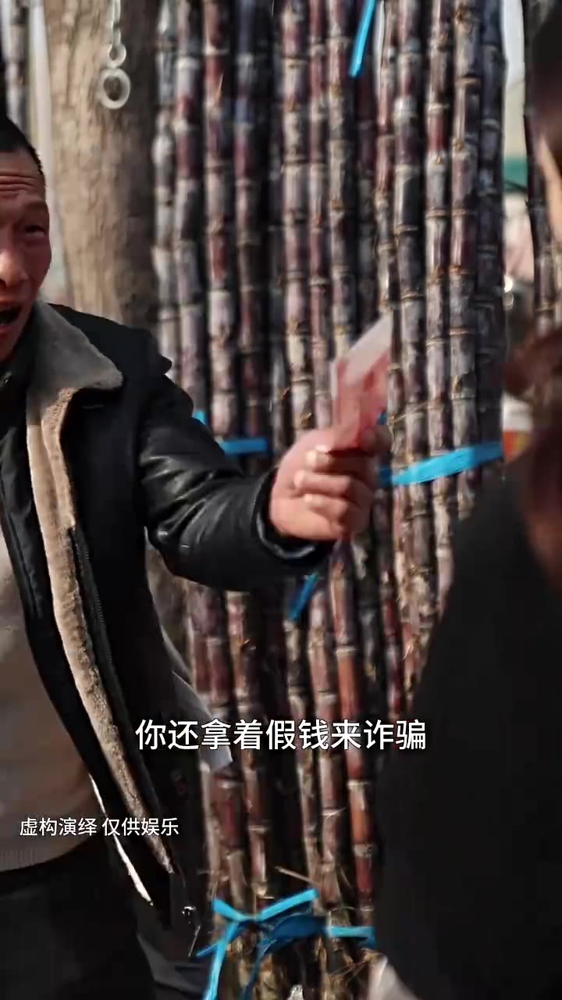
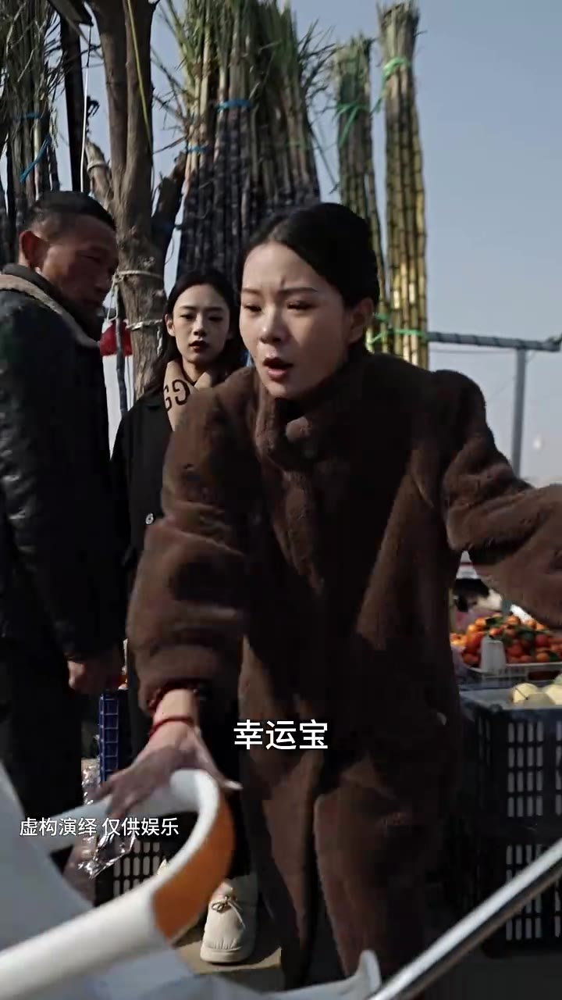

# 《萌宝福星》剧本（增强版：含画面+烧屏字幕）

# 第01集 · 第一集

> 时长 60.1s · 镜头切换 23 处 · 台词 12 段

### 场景 1

> **烧屏字幕**: 你还拿着假钱来诈骗 ／ 虚构演绎仅供娱乐

`000.0` 他拿的假钱来诈骗,我跟你说,你今天你走不了,你不能走,别人跑了,送派的手续,对对对,快抓住他,你这个女骗子今天跑不了你,今天我跟你说,你们这是在干什么,陈总他们不像我说我带了假钱,之前可是你走上钢铁给我的呀,你把他放开,这钱是不是真的咽一下不就知道了,你和他是同伙吧,突然专门骗你呢,走,你快抓走,

### 场景 2

> **烧屏字幕**: 虚构演绎 仅供娱乐

`030.0` 谁做个小买卖还带着烟炒鸡啊，我包里还有啊 我给你换下来

### 场景 3

> **烧屏字幕**: 幸运宝 ／ 虚构演绎仅供娱乐

`040.0` **「轻柔」**

`041.0` 我儿子，我儿子呢

`043.0` **「轻柔不见了」**

`044.0` **「轻柔」**

`046.0` 你们看那是谁抱走孩子的吗

`048.0` **「没看见」**

`049.0` **「不知道」**

### 场景 4

`060.0` **「字幕by索兰娅」**

---

# 第02集 · 第二集

> 时长 78.3s · 镜头切换 20 处 · 台词 17 段

### 场景 1

> **烧屏字幕**: 沈总菜市场没有监控 ／ 虚构演绎仅供娱乐

`000.3` Sino, 拆场没有监控,报警了,还没收到消息，不惜一切代价,也要找到幸运宝，沈总,我,都是我的错,，他不是因为我,所以后来不会被人偷走。

### 场景 2

> **烧屏字幕**: 秦蓉不怪你 ／ 虚构演绎仅供娱乐

`016.6` 你轻柔,不怪一点,都是我守护大业，安排公司所有员工,找到幸运宝的下落,，谁有线索,奖励一千万，Sino,请他打来电话,

### 场景 3

> **烧屏字幕**: 从菜市场旁边超市里 ／ 虚构演绎仅供娱乐

`030.6` 从菜市场旁边的超市�,监控标准的量可依测量。

`034.6` **「幸运量,展开面包车。」**

`036.6` 一定要追查到底,警察那边有什么进展,随时跟我汇报，好,沈总,我们现在就去交警纳的餐馆,测点馅水，我和你一起去,要是找不到幸运宝,我不会愧疚一辈子。

### 场景 4

> **烧屏字幕**: 秦蓉你别去了 ／ 虚构演绎 仅供娱乐

`048.6` 秦荣,你别去了,你都两天没休息了,好好睡一觉吧。

`053.6` **「有消息吗?」**

### 场景 5

> **烧屏字幕**: -虚构演绎仅供娱乐

`055.6` **「谢谢沈总。」**

`056.6` 白正勇,赶紧销毁那辆面包车,警察已经调到借库,怀疑到那辆车了。

---

# 第03集 · 第三集

> 时长 62.5s · 镜头切换 13 处 · 台词 21 段

### 场景 1

> **烧屏字幕**: 蓉姐车已经被我扔到河里了 ／ 虚构演绎仅供娱乐

`000.0` 荣姐 摄影被我扔到河里了，现在大陆上全部都是警车，我好害怕呀，我还有心脏命

### 场景 2

> **烧屏字幕**: 虚构演绎 仅供娱乐

`014.4` 我迷路了

### 场景 3

> **烧屏字幕**: 这是哪我也不知道 ／ 虚构演绎仅供娱乐

`016.3` **「这是哪」**

`017.5` 我也不知道

`019.4` **「荣姐」**

### 场景 4

> **烧屏字幕**: 你不想要赎金了 ／ 虚构演绎 仅供娱乐

`024.1` **「你不想要书惊了」**

`025.8` **「玥玥 你知道吗」**

`033.0` 你先找个地方躲起来听我的安排，我能上哪儿躲

### 场景 5

> **烧屏字幕**: 孩子还哭哭啼啼的 ／ 虚构演绎仅供娱乐

`037.4` **「孩子还孤股滴滴的」**

### 场景 6

> **烧屏字幕**: 等拿到赎金就把那个孩子给解决掉啊 ／ 虚构演绎 仅供娱乐

`040.4` 等拿到书惊就把那孩子给解决掉啊，我现在好害怕荣姐

### 场景 7

> **烧屏字幕**: 千万别让他们找到我 ／ 虚构演绎 仅供娱乐

`046.1` **「千万别让她们找到我」**

### 场景 8

> **烧屏字幕**: 给谁打电话呢 ／ 虚构演绎仅供娱乐

`050.2` **「你谁打电话呢」**

`053.3` **「沈总」**

`054.7` 我，我刚才联系了一个菜市场的熟人，我问问他咱们幸运毛的消息来着

---

# 第04集 · 第四集

> 时长 76.4s · 镜头切换 13 处 · 台词 10 段

### 场景 1

> **烧屏字幕**: 刚才警察那边来电话了 ／ 虚构演绎仅供娱乐

`000.0` 刚才警察那边拿电话了,说是那辆面包车沿着东城的方向跑了,估计很快就能查到线索了。

### 场景 2

> **烧屏字幕**: 嗯查到是什么人了吗 ／ 虚构演绎仅供娱乐

`010.0` **「查到是什么人了吗?」**

### 场景 3

> **烧屏字幕**: 警察还在菜市场那边调查 ／ 虚构演绎 仅供娱乐

`012.0` 警察还在菜市场那边调查,说是一个男人，等我抓到他,我定会让他生不如死。

`021.0` **「青荣,你怎么了?」**

### 场景 4

> **烧屏字幕**: 我有点头晕 ／ 虚构演绎 仅供娱乐

`025.9` **「没事吧,青荣?」**

### 场景 5

> **烧屏字幕**: 怎么不接电话 ／ 虚构演绎仅供娱乐

`058.3` **「怎么不接电话?」**

`060.3` **「不会被发现了吗?」**

`062.3` **「这荒山野嶺,我要往哪藏啊?」**

`066.3` **「别哭了,别哭了。」**

---

# 第05集 · 第五集

> 时长 80.2s · 镜头切换 17 处 · 台词 17 段

### 场景 1

> **烧屏字幕**: 虚构演绎仅供娱乐

`001.5` **「干什么呢?」**

`003.5` **「站住!」**

`004.5` **「怎么会有个孩子啊?」**

`025.4` **「先把我回家再-说吧。」**

`026.4` **「乐乐。」**

### 场景 2

> **烧屏字幕**: 心之能出 ／ 虚构演绎仅供娱乐

`035.2` **「哪一个孩子啊?」**

### 场景 3

> **烧屏字幕**: 山上捡的 ／ 虚构演绎仅供娱乐

`045.1` 山上简单,你看,多可爱，我先带着她吧，哥,你自己都养不活了,你再养个孩子。

### 场景 4

> **烧屏字幕**: 你这不自找麻烦吗 ／ 虚构演绎 仅供娱乐

`053.1` **「你这不自找麻烦吗?」**

### 场景 5

> **烧屏字幕**: 虚构演绎仅供娱乐

`055.1` **「你这说的叫什么话?」**

`057.1` 她能遇上咱们,是咱们的缘分，以后你也得帮我带她,没商量，我这腿脚不方便,没想照顾自己。

### 场景 6

> **烧屏字幕**: 虚构演绎仅供娱乐

`068.5` **「你在弄我孩子?」**

### 场景 7

> **烧屏字幕**: 哎他对我笑了 ／ 虚构演绎 仅供娱乐

`070.5` 哥,她在我笑了,你看。

`073.5` **「长老哥。」**

---
