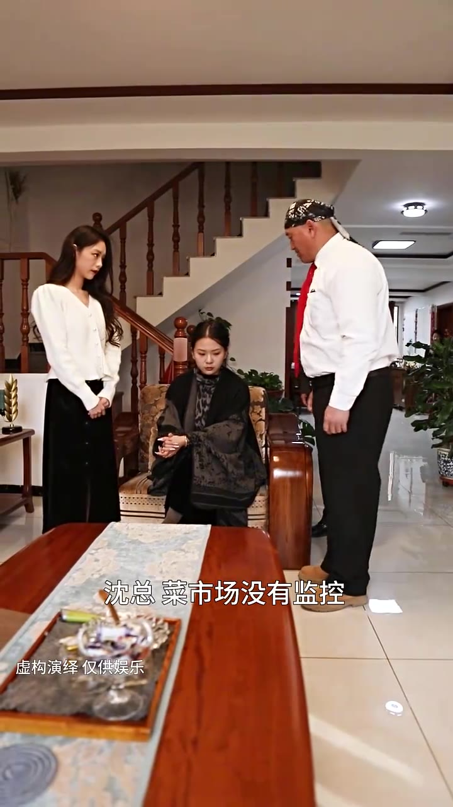
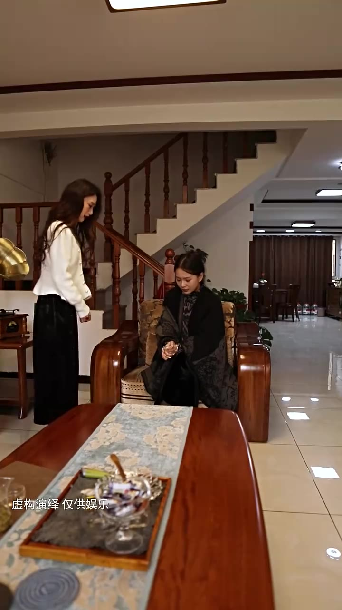

# 第02集 · 第二集

> 时长 78.3s · 镜头切换 20 处 · 台词 17 段

### 场景 1

> **烧屏字幕**: 沈总菜市场没有监控 ／ 虚构演绎仅供娱乐

`000.3` Sino, 拆场没有监控,报警了,还没收到消息，不惜一切代价,也要找到幸运宝，沈总,我,都是我的错,，他不是因为我,所以后来不会被人偷走。

### 场景 2

> **烧屏字幕**: 秦蓉不怪你 ／ 虚构演绎仅供娱乐

`016.6` 你轻柔,不怪一点,都是我守护大业，安排公司所有员工,找到幸运宝的下落,，谁有线索,奖励一千万，Sino,请他打来电话,

### 场景 3

> **烧屏字幕**: 从菜市场旁边超市里 ／ 虚构演绎仅供娱乐

`030.6` 从菜市场旁边的超市�,监控标准的量可依测量。

`034.6` **「幸运量,展开面包车。」**

`036.6` 一定要追查到底,警察那边有什么进展,随时跟我汇报，好,沈总,我们现在就去交警纳的餐馆,测点馅水，我和你一起去,要是找不到幸运宝,我不会愧疚一辈子。

### 场景 4

> **烧屏字幕**: 秦蓉你别去了 ／ 虚构演绎 仅供娱乐

`048.6` 秦荣,你别去了,你都两天没休息了,好好睡一觉吧。

`053.6` **「有消息吗?」**

### 场景 5

> **烧屏字幕**: -虚构演绎仅供娱乐

`055.6` **「谢谢沈总。」**

`056.6` 白正勇,赶紧销毁那辆面包车,警察已经调到借库,怀疑到那辆车了。

