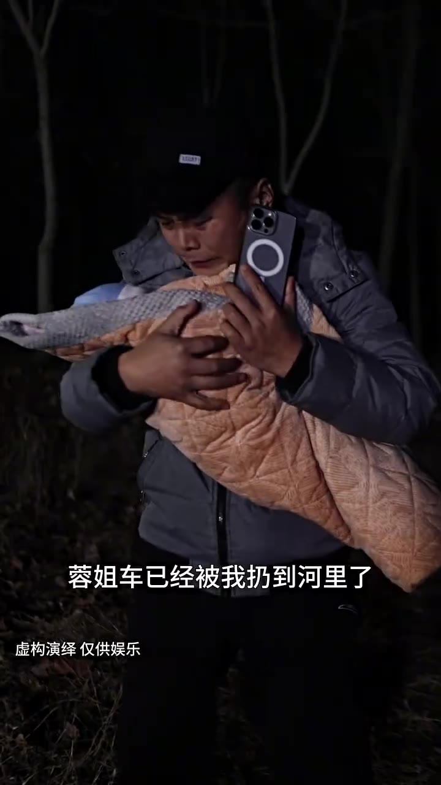

# 第03集 · 第三集

> 时长 62.5s · 镜头切换 13 处 · 台词 21 段

### 场景 1

> **烧屏字幕**: 蓉姐车已经被我扔到河里了 ／ 虚构演绎仅供娱乐

`000.0` 荣姐 摄影被我扔到河里了，现在大陆上全部都是警车，我好害怕呀，我还有心脏命

### 场景 2

> **烧屏字幕**: 虚构演绎 仅供娱乐

`014.4` 我迷路了

### 场景 3

> **烧屏字幕**: 这是哪我也不知道 ／ 虚构演绎仅供娱乐

`016.3` **「这是哪」**

`017.5` 我也不知道

`019.4` **「荣姐」**

### 场景 4

> **烧屏字幕**: 你不想要赎金了 ／ 虚构演绎 仅供娱乐

`024.1` **「你不想要书惊了」**

`025.8` **「玥玥 你知道吗」**

`033.0` 你先找个地方躲起来听我的安排，我能上哪儿躲

### 场景 5

> **烧屏字幕**: 孩子还哭哭啼啼的 ／ 虚构演绎仅供娱乐

`037.4` **「孩子还孤股滴滴的」**

### 场景 6

> **烧屏字幕**: 等拿到赎金就把那个孩子给解决掉啊 ／ 虚构演绎 仅供娱乐

`040.4` 等拿到书惊就把那孩子给解决掉啊，我现在好害怕荣姐

### 场景 7

> **烧屏字幕**: 千万别让他们找到我 ／ 虚构演绎 仅供娱乐

`046.1` **「千万别让她们找到我」**

### 场景 8

> **烧屏字幕**: 给谁打电话呢 ／ 虚构演绎仅供娱乐

`050.2` **「你谁打电话呢」**

`053.3` **「沈总」**

`054.7` 我，我刚才联系了一个菜市场的熟人，我问问他咱们幸运毛的消息来着

