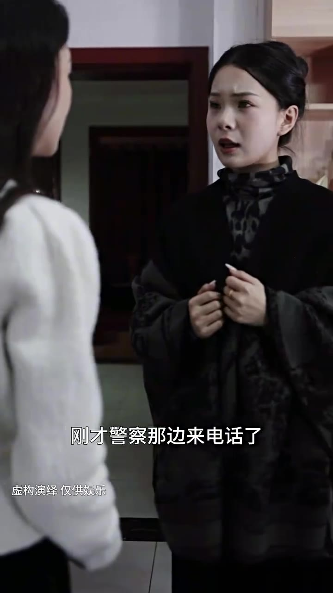

# 第04集 · 第四集

> 时长 76.4s · 镜头切换 13 处 · 台词 10 段

### 场景 1

> **烧屏字幕**: 刚才警察那边来电话了 ／ 虚构演绎仅供娱乐

`000.0` 刚才警察那边拿电话了,说是那辆面包车沿着东城的方向跑了,估计很快就能查到线索了。

### 场景 2

> **烧屏字幕**: 嗯查到是什么人了吗 ／ 虚构演绎仅供娱乐

`010.0` **「查到是什么人了吗?」**

### 场景 3

> **烧屏字幕**: 警察还在菜市场那边调查 ／ 虚构演绎 仅供娱乐

`012.0` 警察还在菜市场那边调查,说是一个男人，等我抓到他,我定会让他生不如死。

`021.0` **「青荣,你怎么了?」**

### 场景 4

> **烧屏字幕**: 我有点头晕 ／ 虚构演绎 仅供娱乐

`025.9` **「没事吧,青荣?」**

### 场景 5

> **烧屏字幕**: 怎么不接电话 ／ 虚构演绎仅供娱乐

`058.3` **「怎么不接电话?」**

`060.3` **「不会被发现了吗?」**

`062.3` **「这荒山野嶺,我要往哪藏啊?」**

`066.3` **「别哭了,别哭了。」**

