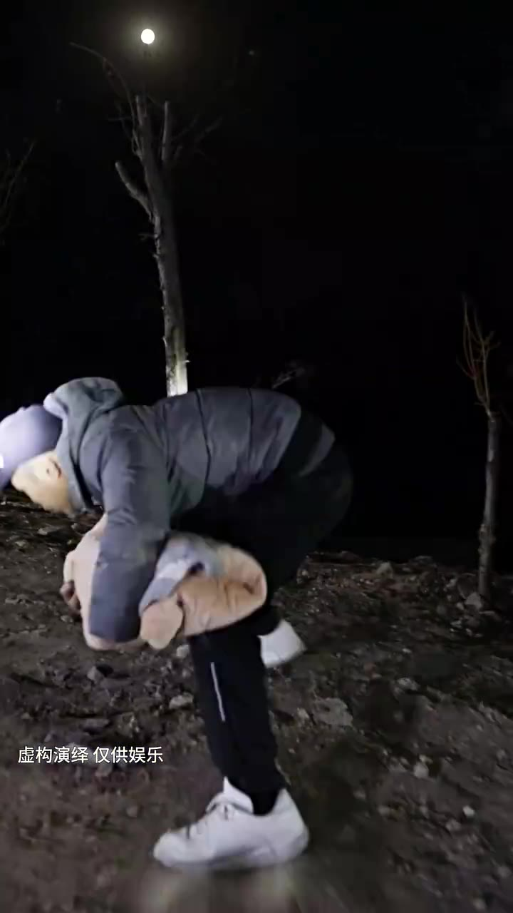
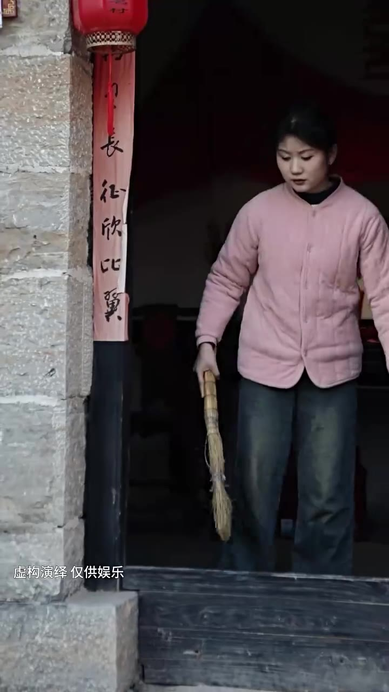
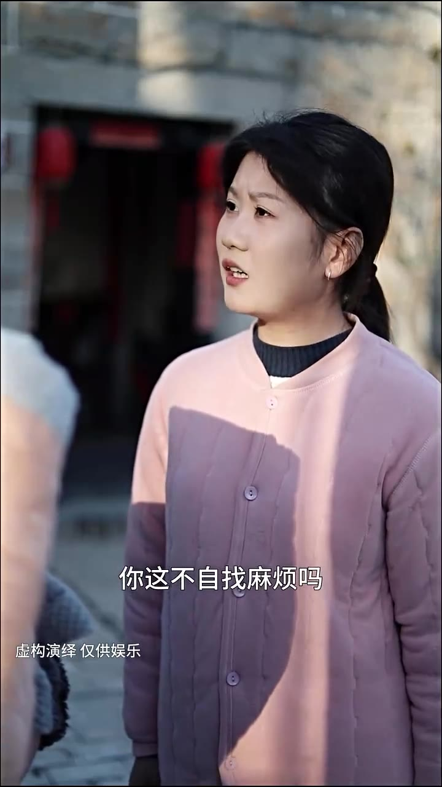
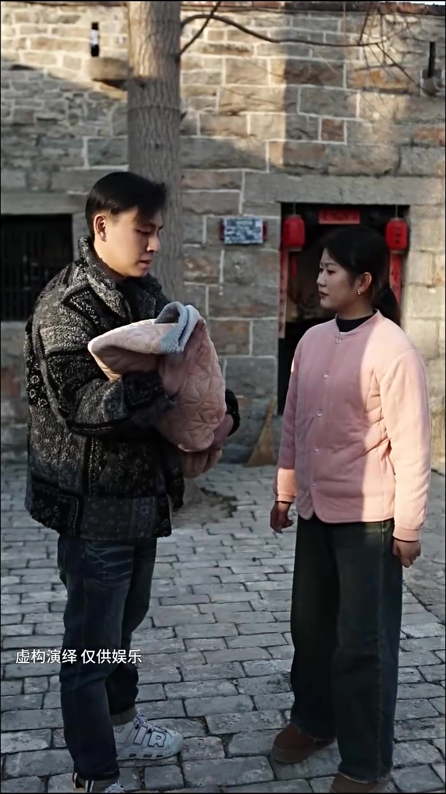
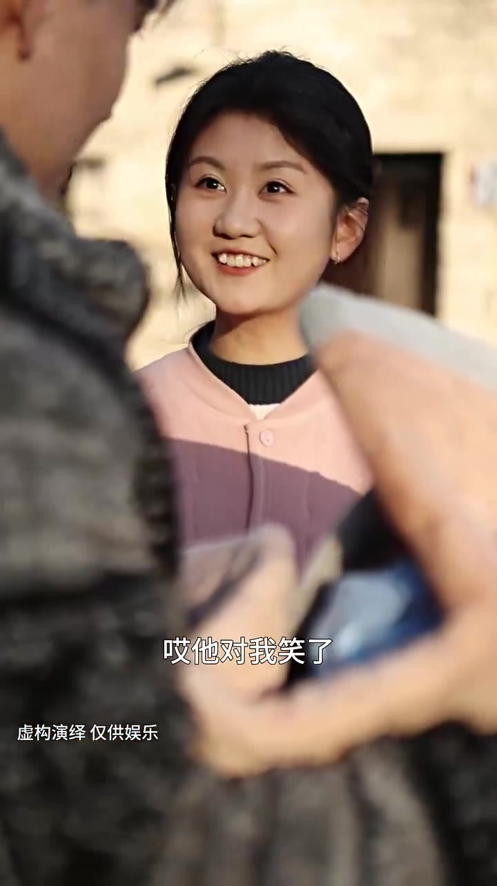

# 第05集 · 第五集

> 时长 80.2s · 镜头切换 17 处 · 台词 17 段

### 场景 1

> **烧屏字幕**: 虚构演绎仅供娱乐

`001.5` **「干什么呢?」**

`003.5` **「站住!」**

`004.5` **「怎么会有个孩子啊?」**

`025.4` **「先把我回家再-说吧。」**

`026.4` **「乐乐。」**

### 场景 2

> **烧屏字幕**: 心之能出 ／ 虚构演绎仅供娱乐

`035.2` **「哪一个孩子啊?」**

### 场景 3

> **烧屏字幕**: 山上捡的 ／ 虚构演绎仅供娱乐

`045.1` 山上简单,你看,多可爱，我先带着她吧，哥,你自己都养不活了,你再养个孩子。

### 场景 4

> **烧屏字幕**: 你这不自找麻烦吗 ／ 虚构演绎 仅供娱乐

`053.1` **「你这不自找麻烦吗?」**

### 场景 5

> **烧屏字幕**: 虚构演绎仅供娱乐

`055.1` **「你这说的叫什么话?」**

`057.1` 她能遇上咱们,是咱们的缘分，以后你也得帮我带她,没商量，我这腿脚不方便,没想照顾自己。

### 场景 6

> **烧屏字幕**: 虚构演绎仅供娱乐

`068.5` **「你在弄我孩子?」**

### 场景 7

> **烧屏字幕**: 哎他对我笑了 ／ 虚构演绎 仅供娱乐

`070.5` 哥,她在我笑了,你看。

`073.5` **「长老哥。」**

