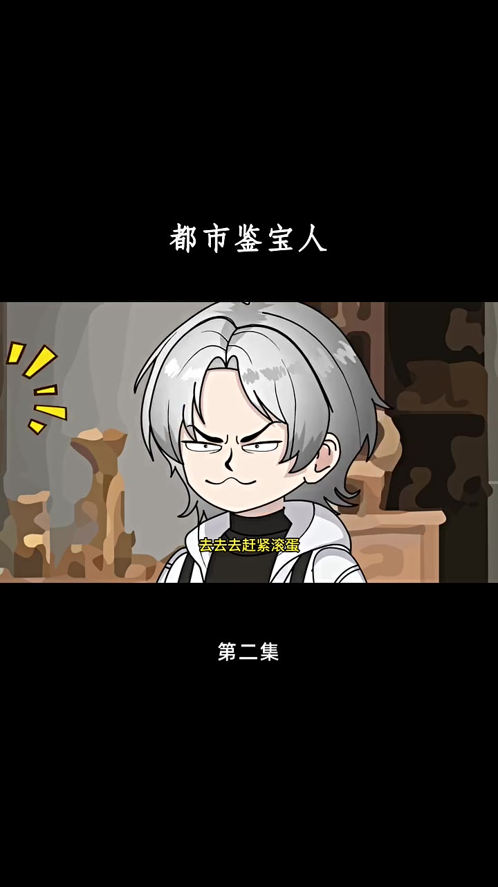

# 第02集 · 第二集

> 时长 189.5s · 镜头切换 0 处 · 台词 58 段

### 场景 1

> **烧屏字幕**: 都市鉴宝人 ／ 去去去赶紧滚蛋 ／ 第二集

`000.0` 区区区 赶紧滚蛋 拿一个假东西也敢开价5万

`005.8` 老板 做真实窝假租串了包备 要不是窝戏份儿在医院登着勇气，龚弟有妥协公子 窝菜补纳出来卖 赶紧滚 别他妈的妨碍老子做生意，老板 我也不要5万了 就一钱秤窝

`021.0` 不是我说你 你就算是要作假 那也麻烦你做的稍微像一点，这玩意儿别说一千 就算是一百 我也不要，大哥 怎么了 是有东西要出吗，优赫 是指你怎么来了 是过来看看店吗

`037.4` 放心 有你许书我来经营 肯定会比你老爸管的时候更好

`043.6` **「嗯 小兄弟 你要卖吗」**

`049.4` **「嗯 这东西 有意思」**

`052.3` 大哥 这个你打算多少出，一钱秤窝 小兄弟 我媳妇儿在医院就差一千块

`059.8` **「好 一千块我要了」**

`061.6` **「哈哈哈哈哈哈哈哈」**

`063.9` 呸 勾烟砍刃底了东西 你的点 赤枣咬晃，哈哈哈 是指啊 古安这一行玩可就是一个严厉，可别打了眼 落的跟你爸一个下场，顶天二十块的东西 你直接拿一千买

`078.1` 你爸的手术应该还差五万吧，看来 你根本就不在乎你爸的死活吗，无知 给你个机会 五万块卖给你

`088.1` **「错过了可就没了」**

`089.4` 哈哈 秦昊 看来你跟你那个白痴老爸一样啊，打眼了也就算了 还非要说直闲，要是我拿五万买下来 那我就真的成傻子了，哼 待会就知道到底谁是傻子了

`101.6` **「今天我倒是想要看看」**

`103.4` 有哪个傻逼会花五万来买你这个宴品，别说超过五万就你这东西，要是有人超过五百来买 我立马给你道歉，好好的经营秦家的店吧 我迟早是会收回来的

`116.1` **「哈哈哈」**

`116.6` 请你搞清楚 据宝宅现在可不幸情 而是兴许，只要有人超过五万来购买 我就去给你爸跪下磕头，好啊 记住你自己说的话，待会 如果要是输了 可千万别不认

`132.9` 嗯 小浩 你怎么过来了

`137.3` 是你爸的女儿吗 我这里只剩一万的四房钱了，你要的话 我先拿给你应应急吧，老规矩 这件事可不能让你沈沈知道，不然你徐叔我就要在店里过夜了

`148.1` 不用徐叔 我就是收了的小东西

`150.9` **「哦 赶紧给我摟一眼」**

`153.1` 小浩 你跟叔说 这小钱你是花多少钱收的

`157.2` **「这傻子可是花了一千块」**

`159.8` 收的 那人要我五万块来收他这个破烂，别说 I 了 就算是五块我都嫌多

`163.8` **「小浩 他说的都是真的」**

`165.6` 嗯 这东西的市场价你应该知道，这完全就是不超过二十块钱的东西，你要出手的话 我就拿两百给你收了吧，要是多了 这事被你沈沈知道了，我不好交代

`178.1` 徐叔 这可不是大路货 它是刁母，刁母大钱可是价值连城 这怎么可能，秦浩啊秦浩 你可真会胡说八道啊，这要是刁母大钱的话 我跪下来给你叫爷爷都行

