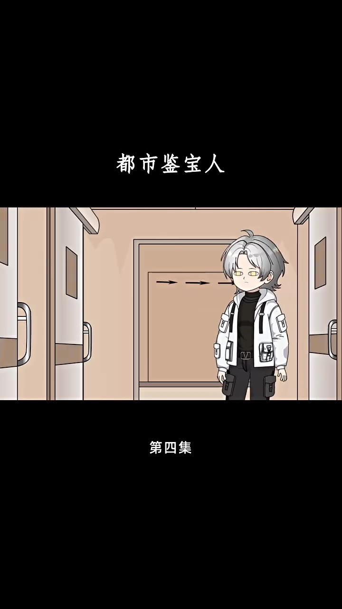
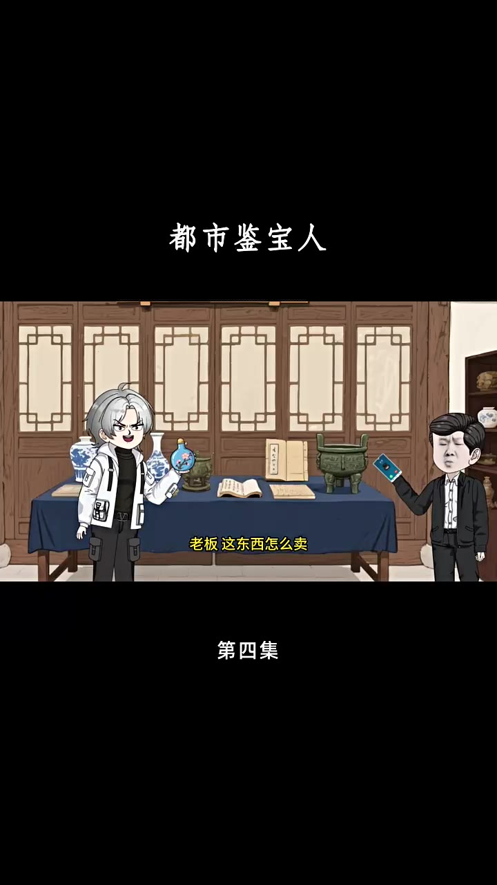

# 第04集 · 第四集

> 时长 184.3s · 镜头切换 1 处 · 台词 37 段

### 场景 1

> **烧屏字幕**: 都市鉴宝人 ／ 第四集

`001.2` 大姐 小妹 三弟 你们放心 我欠你们的钱 肯定会连本带利还给你们的。

`012.5` **「还我们? 秦志源 你现在做手术 都要五十万吧 正好 你就欠我们这么多 干脆也别做手术了 把钱还了吧。」**

`023.5` 对 大姐说的没错 就算你做了手术 要是还是治不好死了 不是拖累了嫂子跟小号吗

`033.5` 我要是你的话 我早就放弃治疗了 是啊二哥 三姐说的没错 家都被你拜光了 你哪还有脸活着

`041.5` **「你 你们」**

`044.5` 老秦 老秦你怎么了 你可不要吓我，秦志源 你有意思吗 一说到还钱就装死

`055.5` 秦浩 你回来的正好 赶紧还钱，哼 好 那我现在就连本带利的还给你们，看你们的手机 我全装给你们了，哼 小妹 四弟 我们拿了钱赶紧走 知不定他这钱是怎么来的呢

`077.9` 你们快滚 从今往后 在无瓜葛

`083.9` 小号 你跟妈说 你哪来这么多钱 是不是干了什么坏事，实在不行 你爸不做手术了 怎么自首吧，妈 我是买了个小物件 结果赚了五十万 这里刚好还剩下五万

`095.9` 尽快安排爸做手术吧 剩下的钱我来想办法

### 场景 2

> **烧屏字幕**: 都市鉴宝人 ／ 老板这东西怎么卖 ／ 第四集

`108.6` **「老板这东西怎么卖」**

`110.6` 五十万 要就拿走 不要就方向，老板你这也太没诚意了 别告诉我你这东西是什么古董，我就是想来买 拿去插花而已

`119.6` **「要买就买 不买就滚蛋」**

`122.6` 等等 我说兄弟啊 我好不容易装出来的样子，你是一点面子也不给 既然看上了 那咱们就聊聊呗，能感兴这不刚才一副表情 就是故意装出来的

`137.5` 老板如果你诚心想卖的话 就五百多一分都不行，这样兄弟 我亏本卖给你 就当做个开门生意 一千块你拿走，哼 哎呀兄弟 五百就五百 就当我开上了 拿去拿去

`152.5` 你好 你手里这笔烟湖 可以给我看看吗

`161.3` **「笔烟湖」**

`163.3` 这妹子的眉语之间 有一缕黑气营造

`165.3` **「这是有血光之灾的前奏」**

`167.3` 美女我劝你最好还是少出门的好 最好找个寺庙住几天

`171.3` **「为什么这么说」**

`172.3` 因为你印堂剧音 内有血光炸线，不日内必有血光之灾 所以还是去寺庙里住几天吧，有佛祖大大照着 你应该会无事，小子 把你的嘴放干净点

