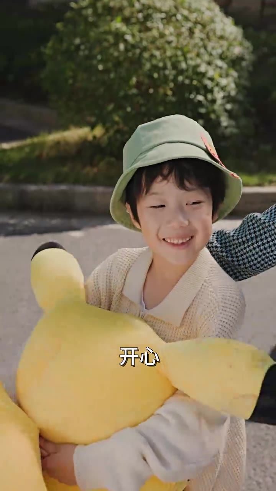

# 第04集 · 第四集

> 时长 90.0s · 镜头切换 60 处 · 台词 20 段

### 场景 1

> **烧屏字幕**: 八分

### 场景 2

> **烧屏字幕**: 开心

`010.9` **「你干啥皮卡丘呢?」**

`011.9` **「开心!」**

`012.9` 走,回家给你做好吃的。

### 场景 3

`038.2` **「你可以放心啦。」**

`040.2` **「是,我才不行。」**

`042.2` **「换成是我出手。」**

`043.2` **「怕这回死得更惨。」**

`045.2` 哪来这些奇奇怪怪的胜负愿，我讲的是这事吗?

`049.2` **「七年没见。」**

### 场景 4

> **烧屏字幕**: 1力

`055.5` **「那个,什么?」**

### 场景 5

`067.4` 是我,我把你救回来的，那没什么事的话,你就先休息着，我先出去了。

### 场景 6

`074.4` **「既然,你救了我一命。」**

`077.8` **「那今晚,我已深相信。」**

`079.8` 我看你伤得还不够。

`081.8` **「都七年了。」**

`082.8` **「你就不能听我解释一下吗?」**

`087.3` **「你要是个妹妹。」**

